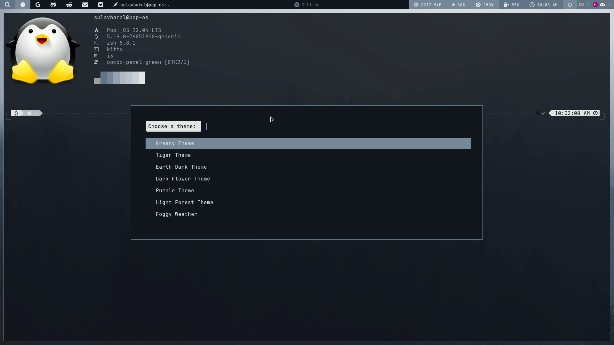
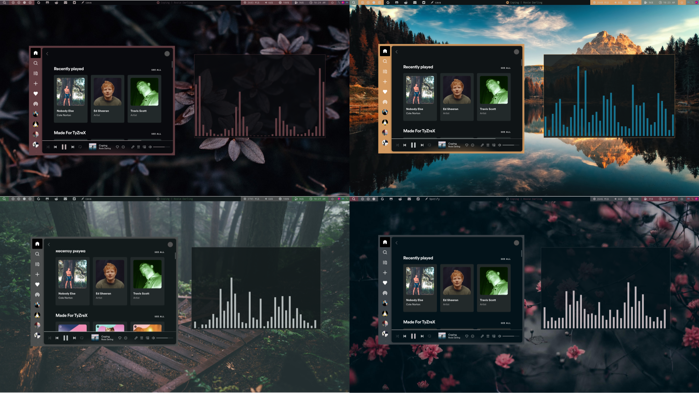

# i3-Theme-Selector

This is a simple theme selector made by using rofi and some bash scripts which use pywal to generate the colors and the colors are applied from Xresources file to rofi, spotify, discord and polybar.

#### Theme Selector Rofi :

---
#### Requirements 

- Pywal 
- Pywal Discord 
- Zathura Pywal
- Spicetify 
- i3-gaps window manager
- Rofi
  
---
  
#### How to Install

Firstly pywal and spicetify needs to be setup the steps for them can be found in their github repositories. Now you have to put the scripts in the home directory.

Also put the themes-wallpaper in the home directory for easy linkup.

For these colors to work in the i3 config file you have to paste these lines.

```
set_from_resource $fg i3wm.color5 #f0f0f0
set_from_resource $bg i3wm.color2 #f0f0f0

# class                 border  backgr. text indicator child_border
client.focused          $bg     $bg     $fg  $bg       $bg
client.focused_inactive $bg     $bg     $fg  $bg       $bg
# client.unfocused        $bg     $bg     $fg  $bg       $bg
client.unfocused        #333333 #222222 #888888 #292d2e   #222222
client.urgent           $bg     $bg     $fg  $bg       $bg
client.placeholder      $bg     $bg     $fg  $bg       $bg

client.background       $bg
```
To remember the last background you have to put the line in i3 config

```
wal -R
```
---
#### Usage
---
You can either directly execute the theme selector script from the terminal or you can bind it from the config file which would then fireup a rofi menu to select the themes
---
#### Themes
